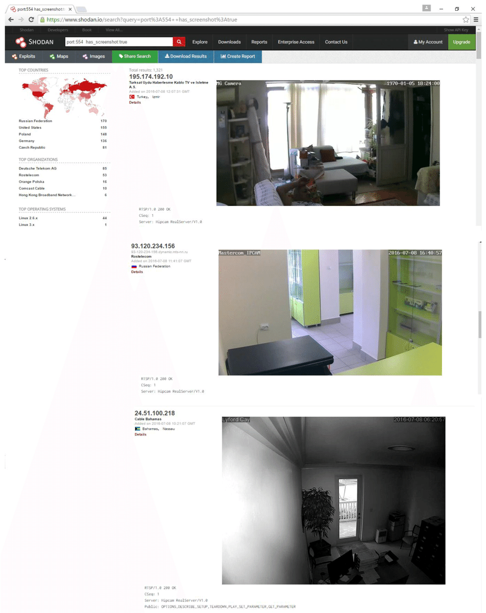

# 【03】資安的原罪 ch.1-1 資料外洩與隱私

# 資料外洩&隱私
資料外洩根本不重要吧?我又沒什麼重要資料!我們先來實際看例子
- [^1] Insecam
- [^2] Shodan

聲音和圖像也是資料的一種，這類型的資料常直接和人們的隱私相連。

## Shodan是什麼網站

Shodan會搜尋全球的聯網設備並擷取其相關資訊，包括IP位址、執行的服務、系統資訊等。
常用功能
explore
maps
exploits
images

搜尋"webcam"即可搜尋到全世界公開IP的Webcam
[^6]

### GB是什麼技術?
Banner Grabbing是一種擷取網路通鋪所運行之服務的資訊技術。

如國存在CVE弱點，就可被利用。弱點在3-2a詳細，而這套流程。

### censys

透過webcam偷窺你，不幸，這很常見[^10]

哭泣天使 三星電視 假關機」的狀態，並在後台開啟程式，通過電視內置麥克風進行錄音，而錄音會通過網路上傳到一個秘密的美國中央情報局（CIA）伺服器上，以達到竊聽的目的。[^7]
掃地機器人不只掃地還會窺視偷看？南韓調查：中國產品存在嚴重安全漏洞[^5] 

新聞 手機 演算法推薦[^8]

Facebook 執行長做的這件事,FBI 局長 James Comey 也這樣做
今年四月美國聯邦調查局長康梅（ James Comey ）在演講時表示，他會把筆電上的視訊鏡頭用不透明膠帶貼起來，以防電腦被駭客入侵、行蹤被偷窺。[^11]

##
實際上資料外洩的案件普遍到
不過筆者相信大部分民眾無感，我們只需要知道即使高資安層級的公司也
這裡只挑幾個比較

## 資料
 - 智慧財產
 - 國家安全

民眾的全名、出生日期、出生地、住家地址、婚姻狀態、身分證號、職業、電話號碼和學歷[^9]

中國驚傳大規模資料外洩，40億筆民眾個資在網際網路裸奔一天[^4]
Cybernews提及持有者疑似將內容依據類型分成16種資料集存放，根據筆數多寡，最多的是名為wechatid_db的資料集，內有8.05億筆微信帳號資料；其次是名為address_db的資料集，內有7.8億筆住宅的地理識別資訊，第三大的資料集名稱為bank，內有6.3億筆涉及信用卡號、存款、消費習慣的金融財務資料。研究人員指出，相關資料是透過精心收集與維護，目的很有可能是彙整所有中國民眾的行為、經濟能力，以及社會狀態。
值得留意的是，光是透過上述的3種資料，就有可能讓攻擊者掌握出民眾的生活型態、消費習慣、借貸與存款的情形等

美人事局

## 終究是虛擬世界的數位，不會
最後我們總結下。然而資料外洩常常只是一種裝置遭到滲透的症狀而已，遭到滲透的裝置能做的不只洩漏資料，我們將在下章看到直接對我們贈成影響的例子。

[^1]: http://www.insecam.org/
[^2]: https://www.shodan.io/
[^3]: https://censys.com/
[^4]: https://www.ithome.com.tw/news/169435
[^5]: https://tw.news.yahoo.com/%E6%8E%83%E5%9C%B0%E6%A9%9F%E5%99%A8%E4%BA%BA%E4%B8%8D%E5%8F%AA%E6%8E%83%E5%9C%B0%E9%82%84%E6%9C%83%E7%AA%BA%E8%A6%96%E5%81%B7%E7%9C%8B-%E5%8D%97%E9%9F%93%E8%AA%BF%E6%9F%A5-%E4%B8%AD%E5%9C%8B%E7%94%A2%E5%93%81%E5%AD%98%E5%9C%A8%E5%9A%B4%E9%87%8D%E5%AE%89%E5%85%A8%E6%BC%8F%E6%B4%9E-071941026.html
[^6]: https://www.researchgate.net/figure/A-list-of-home-surveillance-cameras-device-scanning-search-engine-Shodan_fig4_305311632
[^7]: https://www.inside.com.tw/article/9154-wikileaks-weeping-angel
[^8]: https://www.youtube.com/watch?v=hUcZv926eig
[^9]: https://www.ithome.com.tw/news/133095
[^10]: https://arstechnica.com/tech-policy/2013/03/rat-breeders-meet-the-men-who-spy-on-women-through-their-webcams/
[^11]: https://blog.trendmicro.com.tw/?p=4362